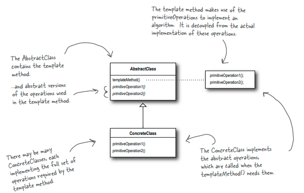
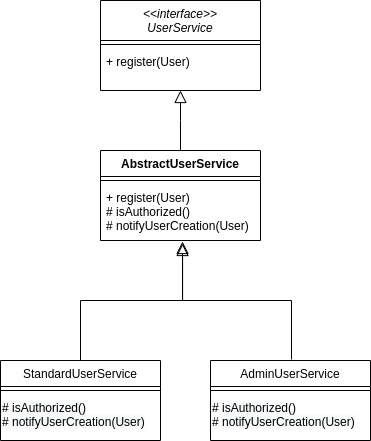

# Design patterns training project

## Template method (Behavioural)

### Intent
Define the skeleton of an algorithm in an operation, deferring some steps to
subclasses. Template Method lets subclasses redefine certain steps of an algorithm
without changing the algorithm's structure.

### Structure

### Example use-case
* Our system offers the functionality to register users.
* We've two kind of users: standard and admin.
* We use a single class to represent both types, as we've a field that indicates the user type.
* The algorithm to create user has the following common steps but with some variants:
    * Validate user existence:
        * Same for both types.
    * Validate call authorization:
        * A standard user could be created for any user with grants to ADD_USERS.
        * An admin user could be created only by admin users.
    * Persist the user:
        * Same for both types.
    * Notify the creation of the user:
        * A standard user creation should be notified by email to the system.
        * An admin user creation should be notified by email and also to an external Admin application.

### Class diagram
