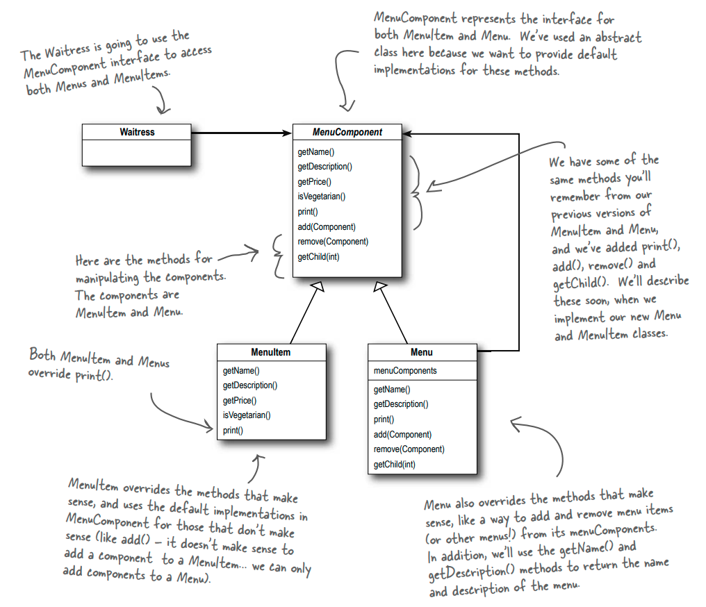
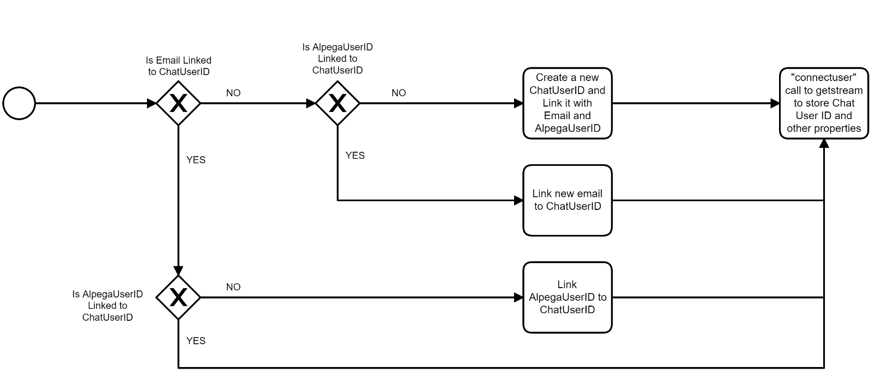
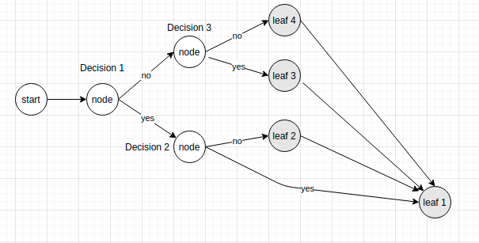

# Design patterns training project

## Composite pattern (Structural)

### Intent
Compose objects into tree structures to represent part-whole hierarchies.
Composite lets clients treat individual objects and compositions of objects
uniformly.

### Structure

### Example use-case
* Real use-case extracted from Chat project: Chat user provisioning.
* https://portal.wkts.eu/pages/viewpage.action?pageId=88980611
* Develop a flow to provision users into the chat provider following this flow:

  
### Abstracting from the flow: tree structure

### Class diagram
