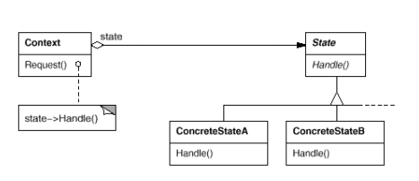
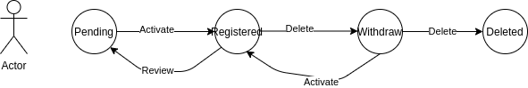
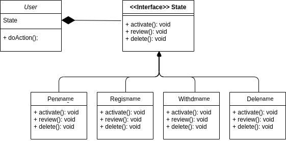

# Design patterns training

## State (Behavioral)

### Intent
Allow an object to alter its behavior when its internal state changes.The object
will appear to change its class.

### Structure

### Example use-case
* Following the User Registration use-case, the user behaviour depends on its state.

### Class diagram
