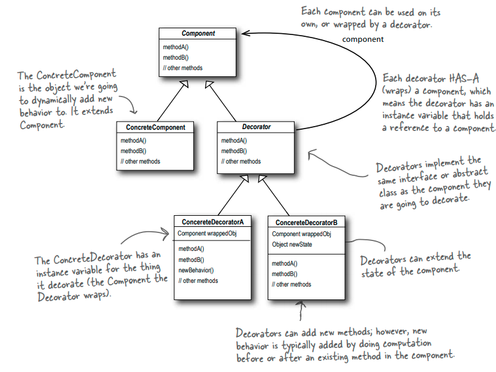
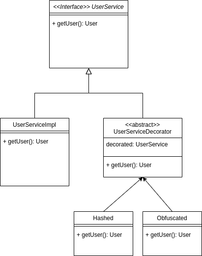

# Design patterns training

## Decorator (Structural)

### Intent
Attach additional responsibilities to an object dynamically. Decorators provide
a flexible alternative to subclassing for extending functionality.

### Structure

### Example use-case
* We've a UserService that allow us to get Users from the persistence context.
* Under certain conditions, we need to extends the service adding functionalities to the getUser method:
    * We need the ability to obfuscate the personal user information.
    * We need the ability to hashing the user with a hash function.

### Class diagram
